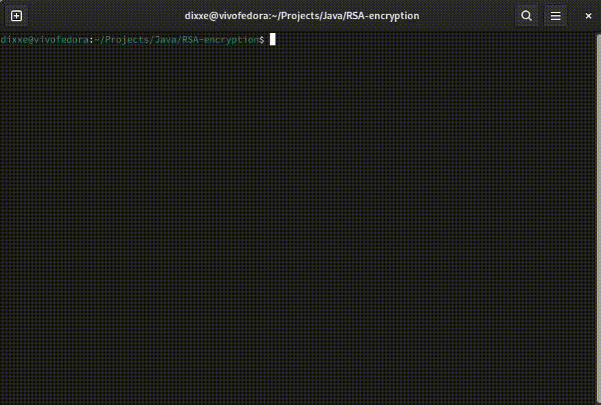

# RSA encryption
maded from scratch RSA encryption for my graduation project

## information:
All jar files were packed in .jar with openjdk17.

<table class="center">
    <tr style="line-height: 0">
    <td width=50% height=30 style="border: none; text-align: center">Preview</td>
    </tr>
    <tr>
    <td width=25% style="border: none"></td>
    </tr>
</table>

## Todo list:
- Docs
- Information about encryption
- Clear code